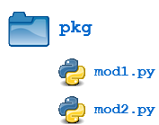
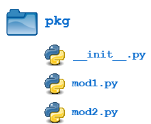
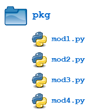
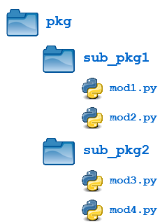

# Модули и пакеты в Python

В этой статье рассматриваются __модули__ и __пакеты__ в Python, два механизма, которые упрощают модульное программирование.

__Модульное программирование__ относится к процессу разделения большой, громоздкой задачи программирования на отдельные, более мелкие, более управляемые подзадачи или __модули__. Затем отдельные модули могут быть собраны вместе, как строительные блоки, для создания более крупного приложения.

Модульность кода в большом приложении дает несколько преимуществ:

- __Простота__: вместо того, чтобы сосредотачиваться на всей проблеме, отдельный модуль обычно фокусируется на одной относительно небольшой части проблемы. Если вы работаете над одним модулем, у вас будет меньшая решаемая задача. Это упрощает разработку и снижает вероятность появления ошибок.

- __Поддержка__: модули обычно проектируются с четкими логическими границами между разными частями программы. Если модули написаны таким образом, это уменьшает взаимозависимость и вероятность появления ошибок при последующих изменения в программе. Вы даже можете вносить изменения в модуль, не зная о приложении вне этого модуля. Это дает возможность одновременной работе команде программистов, которые разрабатывают один проект.

- __Возможность повторного использования__: Функциональность, определенная в одном модуле, может быть легко повторно использована (через должным образом определенный интерфейс) другими частями приложения. Это избавляет от необходимости дублировать код.

- __Область использования__: модули обычно определяют отдельное пространство имен, что помогает избежать конфликтов между идентификаторами в разных областях программы. (Один из постулатов дзен Python заключается в том, что _пространства имен - это отличная идея - давайте сделаем их больше!_).

__Функции__, __модули__ и __пакеты__ - все это конструкции в Python, которые способствуют модульности кода.

## Модули Python: Обзор

На самом деле существует три разных способа определить __модуль__ в Python:

1. Модуль может быть написан на самом Python.
2. Модуль может быть написан на __C__ и загружен динамически во время выполнения, как модуль re( регулярное выражение ).
3. Встроенный модуль структурно содержится в интерпретаторе, как _itertools_ модуль .

Получение доступа к содержимому модуля во всех трех случаях осуществляется одинаково: с помощью оператора __import__.

В статье основное внимание будет уделено модулям, написанным на Python. Самое замечательное в модулях, написанных на Python, заключается в том, что их чрезвычайно просто создать. Все, что вам нужно сделать, это создать файл, содержащий  код Python, а затем дать этому файлу имя с `.py` расширением. Вот и все! Никакого специального синтаксиса или колдовства не требуется.

Например, предположим, что мы создали файл с именем, `mod.py` содержащий следующий код:

```python
s = "If Comrade Napoleon says it, it must be right."
a = [100, 200, 300]

def foo(arg):
    print(f'arg = {arg}')

class Foo:
    pass
```

Некоторые объекты определенные в mod.py:

- s (a string)
- a (a list)
- foo() (a function)
- Foo (a class)
  
Предполагая, что файл (модуль) _mod.py_ находятся в подходящем месте в файловой системе компьютера, о котором мы поговорим чуть позже, к объектам модуля можно получить доступ, импортировав модуль следующим образом:

```python
>>> import mod
>>> print(mod.s)
If Comrade Napoleon says it, it must be right.
>>> mod.a
[100, 200, 300]
>>> mod.foo(['quux', 'corge', 'grault'])
arg = ['quux', 'corge', 'grault']
>>> x = mod.Foo()
>>> x
<mod.Foo object at 0x03C181F0>
```

## The Module Search Path

Продолжая приведенный выше пример, давайте посмотрим, что происходит, когда Python выполняет строку с оператором _import_:

```python
import mod
```

Когда интерпретатор выполняет вышеуказанный _import_ оператор, он ищет модуль _mod.py_ в списке директорий (мест), собранных из следующих источников:

- Директория, из которой был запущен входной сценарий, или текущий каталог, если интерпретатор запускается в интерактивном режиме.
- Список директорий, содержащихся в [PYTHONPATH](https://docs.python.org/3/using/cmdline.html#envvar-PYTHONPATH) переменной окружения, если она установлена. (Формат для PYTHONPATH зависит от ОС, но должен имитировать PATH переменную среды.)
- Зависящий от установки список директорий, настроенный во время установки Python.
- 
Итоговый список всех директорий (путей), в которых ведется поиск модулей, доступен в переменной Python `sys.path` из модуля __sys__:

```python
>>> import sys
>>> sys.path
['', 'C:\\Users\\john\\Documents\\Python\\doc', 'C:\\Python36\\Lib\\idlelib',
'C:\\Python36\\python36.zip', 'C:\\Python36\\DLLs', 'C:\\Python36\\lib',
'C:\\Python36', 'C:\\Python36\\lib\\site-packages']
```

> __Примечание__: точное значение переменной _sys.path_ зависит от параметров установки Python на вашем компьютере и ОС. Вышеупомянутый список путей наверняка будет выглядеть немного иначе на вашем компьютере.

Таким образом, чтобы убедиться, что ваш модуль найден, вам необходимо выполнить одно из следующих действий:

- Поместите _mod.py_ в каталог, в котором находится входной скрипт (исполняемый файл Python), или в текущий каталог, откуда мы заходим в интерактивный режим (Python Shell).
- Измените PYTHONPATH переменную среды, чтобы она содержала каталог, в котором расположен модуль _mod.py_, перед запуском интерпретатора.
- Поместите модуль _mod.py_ в один из каталогов переменной PYTHONPATH.

На самом деле есть одна дополнительная возможность: вы можете поместить файл модуля в любой каталог по вашему выбору, а затем изменить _sys.path_ во время выполнения, чтобы он содержал этот каталог. Например, в этом случае вы можете поместить модуль _mod.py_ в каталог, _C:\Users\johnа_ затем выполнить следующие выражения:

```python
>>> sys.path.append(r'C:\Users\john')
>>> sys.path
['', 'C:\\Users\\john\\Documents\\Python\\doc', 'C:\\Python36\\Lib\\idlelib',
'C:\\Python36\\python36.zip', 'C:\\Python36\\DLLs', 'C:\\Python36\\lib',
'C:\\Python36', 'C:\\Python36\\lib\\site-packages', 'C:\\Users\\john']
>>> import mod
```

После того, как модуль был импортирован, мы можем определить его расположение в файловой системе с помощью `__file__` атрибута импортированного модуля:

```python
>>> import mod
>>> mod.__file__
'C:\\Users\\john\\mod.py'

>>> import re
>>> re.__file__
'C:\\Python36\\lib\\re.py'
```

## Оператор import

Содержимое модуля становится доступным для вызывающего абонента с помощью _import_ оператора. Выражение с оператором _import_ имеет несколько вариантов использования. Рассмотрим их по отдельности.

### import <module_name>

С данным выражением мы уже сталкивались в примерах выше:

```python
import <module_name>
```

Обратите внимание, что это не делает содержимое модуля напрямую вызываемым. Каждый модуль имеет свою собственную частную таблицу символов, которая служит глобальной таблицей символов для всех объектов, определенных в модуле. Таким образом, как уже отмечалось, модуль имеет отдельное пространство имен.

Оператор `import <module_name>` помещает <module_name> в вызывающую символьную таблицу. Объекты, определенные в модуле остаются в частной таблице символов модуля.

Из вызывающего объекта объекты в модуле доступны только в том случае, если они имеют префикс <module_name>, соединенный через точку, как показано ниже.

После следующего _import_ оператора модуль _mod_ помещается в локальную таблицу символов:

```python
>>> import mod
>>> mod
<module 'mod' from 'C:\\Users\\john\\Documents\\Python\\doc\\mod.py'>
```

Но `s` и `foo` остаются в пространстве имен модуля и не могут быть вызваны напрямую

```python
>>> s
NameError: name 's' is not defined
>>> foo('quux')
NameError: name 'foo' is not defined
```

Для доступа к объектам их имена должны иметь префикс _mod_:

```python
>>> mod.s
'If Comrade Napoleon says it, it must be right.'
>>> mod.foo('quux')
arg = quux
```

В одном выражении с оператором _import_ можно указать несколько модулей, разделенных запятыми:

```python
import <module_name>[, <module_name> ...]
```

### from <module_name> import <name(s)>

Альтернативная форма _import_ выражения позволяет импортировать отдельные объекты из модуля непосредственно в таблицу символов вызывающего объекта:

```python
from <module_name> import <name(s)>
```

После выполнения вышеуказанного выражения объекты _<name(s)>_ доступны без _<module_name>_ префикса:

```python
>>> from mod import s, foo
>>> s
'If Comrade Napoleon says it, it must be right.'
>>> foo('quux')
arg = quux

>>> from mod import Foo
>>> x = Foo()
>>> x
<mod.Foo object at 0x02E3AD50>
```

В таком формате выражения _import_ имена объектов помещаются непосредственно в таблицу символов вызывающего объекта, любые объекты, которые уже существуют с такими же именами, будут перезаписаны:

```python
>>> a = ['foo', 'bar', 'baz']
>>> a
['foo', 'bar', 'baz']

>>> from mod import a
>>> a
[100, 200, 300]
```

Можно извлечь все содержимое модуля с помощью следующего выражения:

```python
from <module_name> import *
```

Это поместит имена всех объектов из _<module_name>_ в локальную таблицу символов, за исключением тех, которые начинаются с символа `_` нижнего подчеркивания.

```python
>>> from mod import *
>>> s
'If Comrade Napoleon says it, it must be right.'
>>> a
[100, 200, 300]
>>> foo
<function foo at 0x03B449C0>
>>> Foo
<class 'mod.Foo'>
```

Такого рода импорты не рекомендуется. Это немного опасно, потому что мы массово вводите имена в локальную таблицу символов. Если мы не знаем их все хорошо и не уверены, что конфликта не будет, у нас есть шанс случайно перезаписать существующие имена. Однако этот синтаксис очень удобен, когда вы просто работаете с интерактивным интерпретатором для целей тестирования или изучения, потому что он предоставляет вам доступ ко всему, что может предложить модуль, с меньшим набором текста.

### from <module_name> import <name> as <alt_name>

Также можно импортировать отдельные объекты, но вводить их в локальную таблицу символов с альтернативными именами:

```python
from <module_name> import <name> as <alt_name>[, <name> as <alt_name> …]
```

Это позволяет помещать имена непосредственно в локальную таблицу символов, но избегать конфликтов с ранее существовавшими именами или использовать более удобные и подходящие имена:

```python
>>> s = 'foo'
>>> a = ['foo', 'bar', 'baz']

>>> from mod import s as string, a as alist
>>> s
'foo'
>>> string
'If Comrade Napoleon says it, it must be right.'
>>> a
['foo', 'bar', 'baz']
>>> alist
[100, 200, 300]
```

### import <module_name> as <alt_name>

Мы также можем импортировать весь модуль под другим именем:

```python
import <module_name> as <alt_name>
```

```python
>>> import mod as my_module
>>> my_module.a
[100, 200, 300]
>>> my_module.foo('qux')
arg = qux
```

Содержимое модуля можно импортировать в теле самой функции. В этом случае модуль не будет импортирован, пока функция не будет вызвана:

```python
>>> def bar():
...     from mod import foo
...     foo('corge')
...

>>> bar()
arg = corge
```

Однако __Python 3__ не допускает использование конструкции `import *` внутри функции:

```python
>>> def bar():
...     from mod import *
...
SyntaxError: import * only allowed at module level
```

Ошибки при импортировании модулей (__ImportError__) можно отлавливать конструкцией `try...except`:

```python
>>> try:
...     # Non-existent module
...     import baz
... except ImportError:
...     print('Module not found')
...

Module not found
```

```python
>>> try:
...     # Existing module, but non-existent object
...     from mod import baz
... except ImportError:
...     print('Object not found in module')
...

Object not found in module
```

## Функция dir()

Встроенная функция _dir()_ возвращает список объектов в указанном пространстве имен. Без аргументов он создает отсортированный по алфавиту список имен в текущей локальной таблице символов:

```python
>>> dir()
['__annotations__', '__builtins__', '__doc__', '__loader__', '__name__',
'__package__', '__spec__']

>>> qux = [1, 2, 3, 4, 5]
>>> dir()
['__annotations__', '__builtins__', '__doc__', '__loader__', '__name__',
'__package__', '__spec__', 'qux']

>>> class Bar():
...     pass
...
>>> x = Bar()
>>> dir()
['Bar', '__annotations__', '__builtins__', '__doc__', '__loader__', '__name__',
'__package__', '__spec__', 'qux', 'x']
```

Обратите внимание, как при первом вызове функции _dir()_ мы видим несколько имен, которые определяются автоматически и уже находятся в пространстве имен при запуске интерпретатора. После создания новых объектов их имена (_qux_, _Bar_, _x_) появляются на последующих вызовах _dir()_.

Это может быть полезно для определения того, что именно было добавлено в пространство имен с помощью оператора импорта:

```python
>>> dir()
['__annotations__', '__builtins__', '__doc__', '__loader__', '__name__',
'__package__', '__spec__']

>>> import mod
>>> dir()
['__annotations__', '__builtins__', '__doc__', '__loader__', '__name__',
'__package__', '__spec__', 'mod']

>>> from mod import a, Foo
>>> dir()
['Foo', '__annotations__', '__builtins__', '__doc__', '__loader__', '__name__',
'__package__', '__spec__', 'a', 'mod']

>>> from mod import s as string
>>> dir()
['Foo', '__annotations__', '__builtins__', '__doc__', '__loader__', '__name__',
'__package__', '__spec__', 'a', 'mod', 'string', 'x']
```

При передачи модуля в качестве аргумента функции _dir()_, будет возвращен список пространства имен переданного модуля:

```python
>>> import mod
>>> dir(mod)
['Foo', '__builtins__', '__cached__', '__doc__', '__file__', '__loader__',
'__name__', '__package__', '__spec__', 'a', 'foo', 's']
```

```python
>>> dir()
['__annotations__', '__builtins__', '__doc__', '__loader__', '__name__',
'__package__', '__spec__']
>>> from mod import *
>>> dir()
['Foo', '__annotations__', '__builtins__', '__doc__', '__loader__', '__name__',
'__package__', '__spec__', 'a', 'foo', 's']
```

## Выполнение модуля как скрипта

Любой __.py__ файл, содержащий модуль, является сценарием Python, и нет никаких причин, по которым он не может быть выполнен отдельно.

Содержимое __mod.py__ модуля:

```python
s = "If Comrade Napoleon says it, it must be right."
a = [100, 200, 300]

def foo(arg):
    print(f'arg = {arg}')

class Foo:
    pass
```

Данный файл можно запустить отдельно, как скрипт:

```shell
C:\Users\john\Documents>python mod.py
C:\Users\john\Documents>
```

Ошибок нет, скрипт был выполнен. Конечно, это не очень интересно. Наш модуль только определяет объекты. Он ничего не делает с ними и ничего больше не выполняет.

Давайте изменим указанный выше модуль _Python_, чтобы он генерировал некоторый вывод при запуске как скрипт:

_mod.py_

```python
s = "If Comrade Napoleon says it, it must be right."
a = [100, 200, 300]

def foo(arg):
    print(f'arg = {arg}')

class Foo:
    pass

print(s)
print(a)
foo('quux')
x = Foo()
print(x)
```

Теперь должно быть немного поинтереснее:

```shell
C:\Users\john\Documents>python mod.py
If Comrade Napoleon says it, it must be right.
[100, 200, 300]
arg = quux
<__main__.Foo object at 0x02F101D0>
```

К сожалению, теперь он выполняет те же самые команды при импорте в качестве модуля:

```python
>>> import mod
If Comrade Napoleon says it, it must be right.
[100, 200, 300]
arg = quux
<mod.Foo object at 0x0169AD50>
```

Вероятно, это не то, что нам нужно. Было бы неплохо, если бы мы могли различать, когда файл загружается как модуль, и когда он запускается как отдельный скрипт.

Когда _.py_ файл импортируется как модуль, _Python_ устанавливает специальную __dunder__ переменную (переменная декорированная с обеих сторон двойными знаками нижнего подчеркивания) *\_\_name\_\_*, содержащую имя модуля. Однако, если файл запускается как отдельный скрипт, *\_\_name\_\_* принимает значение '*\_\_main\_\_*'. Таким образом, мы можем определить поведение модуля во время выполнения:

_mod.py_

```python
s = "If Comrade Napoleon says it, it must be right."
a = [100, 200, 300]

def foo(arg):
    print(f'arg = {arg}')

class Foo:
    pass

if (__name__ == '__main__'):
    print('Executing as standalone script')
    print(s)
    print(a)
    foo('quux')
    x = Foo()
    print(x)
```

Попробуем снова запустить наш скрипт _mod.py_:

```shell
C:\Users\john\Documents>python mod.py
Executing as standalone script
If Comrade Napoleon says it, it must be right.
[100, 200, 300]
arg = quux
<__main__.Foo object at 0x03450690>
```

При импортировании модуля блок `if (__name__ == '__main__')` не выполняется:

```python
>>> import mod
>>> mod.foo('grault')
arg = grault
```

Модули часто проектируются с возможностью запуска в качестве отдельного сценария в целях тестирования функциональности, содержащейся в модуле. Это называется модульным тестированием (__unit tests__). Например, предположим, что мы создали модуль _fact.py_, содержащий факториальную функцию, как показано ниже:

_fact.py_

```python
def fact(n):
    return 1 if n == 1 else n * fact(n-1)

if (__name__ == '__main__'):
    import sys
    if len(sys.argv) > 1:
        print(fact(int(sys.argv[1])))
```

Файл можно рассматривать как модуль, а функцию _fact()_ можно импортировать отдельно:

```python
>>> from fact import fact
>>> fact(6)
720
```

Но его также можно запустить отдельно, передав целочисленный аргумент в командной строке для тестирования:

```shell
C:\Users\john\Documents>python fact.py 6
720
```

## Перезагрузка модуля

Из соображений эффективности модуль загружается только один раз за сеанс работы интерпретатора. Это нормально для определений функций и классов, которые обычно составляют основную часть содержимого модуля. Но модуль также может содержать исполняемые операторы, применяемые обычно для инициализации. Имейте в виду, что эти операторы будут выполняться только при первом импорте модуля.

Рассмотрим следующий файл _mod.py_:

_mod.py_

```python
a = [100, 200, 300]
print('a =', a)
```

```python
>>> import mod
a = [100, 200, 300]
>>> import mod
>>> import mod

>>> mod.a
[100, 200, 300]
```

Оператор _print()_ не выполняется при повторных импортах. (В этом отношении, ни то, ни другое не является оператором присваивания, но, как показывает последнее отображение значения _mod.a_, это не имеет значения. Как только присваивание выполнено, оно остается неизменным.)

Если вы вносите изменения в модуль и вам нужно его перезагрузить, вам нужно либо перезапустить интерпретатор, либо использовать функцию __reload()__ из модуля __importlib__:

```python
a = [100, 200, 300]

>>> import mod

>>> import importlib
>>> importlib.reload(mod)
a = [100, 200, 300]
<module 'mod' from 'C:\\Users\\john\\Documents\\Python\\doc\\mod.py'>
```

## Пакеты модулей в Python

Предположим, вы разработали очень большое приложение, включающее множество модулей. По мере роста количества модулей становится трудно их всех отслеживать, потому что они хранятся в одном каталоге. Модули могут похожие названия. Вы можете задуматься над группировкой и организацией модулей.

Пакеты позволяют реализовать иерархическое структурирование пространства имен множества модулей с использованием точечной нотации. Точно так же, как модули помогают избежать конфликтов между именами глобальных переменных, пакеты помогают избегать конфликтов между именами модулей.

Создать пакет довольно просто, поскольку он использует присущую операционной системе иерархическую файловую структуру. Рассмотрим следующую схему:



Здесь есть каталог с именем _pkg_, содержащий два модуля _mod1.py_ и _mod2.py_. Содержимое модулей:

_mod1.py_

```python
def foo():
    print('[mod1] foo()')

class Foo:
    pass
```

_mod2.py_

```python
def bar():
    print('[mod2] bar()')

class Bar:
    pass
```

Учитывая эту структуру, если _pkg_ каталог находится в том месте, где он может быть найден (в одном из путей переменной _sys.path_), вы можете ссылаться на два модуля с помощью точечной нотации (_pkg.mod1_, _pkg.mod2_) и импортировать их с помощью оператора _import_:

```python
>>> import pkg.mod1, pkg.mod2
>>> pkg.mod1.foo()
[mod1] foo()
>>> x = pkg.mod2.Bar()
>>> x
<pkg.mod2.Bar object at 0x033F7290>
```

```python
>>> from pkg.mod1 import foo
>>> foo()
[mod1] foo()
```

```python
>>> from pkg.mod2 import Bar as Qux
>>> x = Qux()
>>> x
<pkg.mod2.Bar object at 0x036DFFD0>
```

Вы также можете импортировать модули с помощью этих конструкций:

```python
from <package_name> import <modules_name>[, <module_name> ...]
from <package_name> import <module_name> as <alt_name>
```

```python
>>> from pkg import mod1
>>> mod1.foo()
[mod1] foo()

>>> from pkg import mod2 as quux
>>> quux.bar()
[mod2] bar()
```

Технически вы также можете импортировать пакет:

```python
>>> import pkg
>>> pkg
<module 'pkg' (namespace)>
```

Но от этого мало толку. Хотя это, строго говоря, синтаксически правильный оператор Python, но он не делает ничего полезного. В частности, он не помещает какие-либо модули _pkg_ в локальное пространство имен:

```python
>>> pkg.mod1
Traceback (most recent call last):
  File "<pyshell#34>", line 1, in <module>
    pkg.mod1
AttributeError: module 'pkg' has no attribute 'mod1'
>>> pkg.mod1.foo()
Traceback (most recent call last):
  File "<pyshell#35>", line 1, in <module>
    pkg.mod1.foo()
AttributeError: module 'pkg' has no attribute 'mod1'
>>> pkg.mod2.Bar()
Traceback (most recent call last):
  File "<pyshell#36>", line 1, in <module>
    pkg.mod2.Bar()
AttributeError: module 'pkg' has no attribute 'mod2'
```

Чтобы фактически импортировать модули или их содержимое, вам необходимо использовать одну из форм, представленных выше.

## Инициализация пакета

Если файл с именем `__init__.py` присутствует в каталоге пакета, он вызывается при импорте пакета или модуля в пакете. Это может использоваться для выполнения кода инициализации пакета, такого как инициализация данных уровня пакета.

Например, рассмотрим следующий `__init__.py` файл:

*\_\_init\_\_.py*

```python
print(f'Invoking __init__.py for {__name__}')
A = ['quux', 'corge', 'grault']
```

Добавим этот файл в каталог _pkg_ из приведенного выше примера:



Теперь при импорте пакета инициализируется глобальный список `A`:

```python
>>> import pkg
Invoking __init__.py for pkg
>>> pkg.A
['quux', 'corge', 'grault']
```

Модуль в пакете может получить доступ к глобальной переменной с помощью импорта:

_mod1.py_

```python
def foo():
    from pkg import A
    print('[mod1] foo() / A = ', A)

class Foo:
    pass
```

```python
>>> from pkg import mod1
Invoking __init__.py for pkg
>>> mod1.foo()
[mod1] foo() / A =  ['quux', 'corge', 'grault']
```

`__init__.py` также может использоваться для автоматического импорта модулей из пакета. Например, ранее вы видели, что выражени `import pkg` только помещает имя _pkg_ в локальную таблицу символов вызывающего объекта и не импортирует никаких модулей. Но если в файле `__init__.py` в каталоге _pkg_ содержится следующее:

*\_\_init\_\_.py*

```python
print(f'Invoking __init__.py for {__name__}')
import pkg.mod1, pkg.mod2
```

После этого, когда вы выполняете `import pkg`, модули _mod1_ и _mod2_ импортируются автоматически:

```python
>>> import pkg
Invoking __init__.py for pkg
>>> pkg.mod1.foo()
[mod1] foo()
>>> pkg.mod2.bar()
[mod2] bar()
```

>__Примечание__. Большая часть документации Python утверждает, что `__init__.py` файл должен присутствовать в каталоге пакета при создании пакета. Когда-то это было правдой. Раньше считалось, что само наличие `__init__.py` файла для Python означало, что это каталог пакета. Файл мог содержать код инициализации или даже быть пустым, но он должен был присутствовать.
>
>Начиная с __Python 3.3__ , были введены неявные пакеты пространства имен. Это позволяет создавать пакет без какого-либо `__init__.py` файла. Конечно, он все еще может присутствовать, если требуется инициализация пакета. Но это больше не является обязательным.

## import * from package

Для целей следующего обсуждения ранее рассматриваемый пакет расширен дополнительными модулями:



Теперь в _pkg_ каталоге расположены четыре модуля. Их содержимое показано ниже:

_mod1.py_

```python
def foo():
    print('[mod1] foo()')

class Foo:
    pass
```

_mod2.py_

```python
def bar():
    print('[mod2] bar()')

class Bar:
    pass
```

_mod3.py_

```python
def baz():
    print('[mod3] baz()')

class Baz:
    pass
```

_mod4.py_

```python
def qux():
    print('[mod4] qux()')

class Qux:
    pass
```

Мы уже видели, что при использовании выражения `import *` для модуля, все объекты из модуля импортируются в локальную таблицу символов, за исключением тех, чьи имена начинаются с знака нижнего подчеркивания:

```python
['__annotations__', '__builtins__', '__doc__', '__loader__', '__name__',
'__package__', '__spec__']

>>> from pkg.mod3 import *

>>> dir()
['Baz', '__annotations__', '__builtins__', '__doc__', '__loader__', '__name__',
'__package__', '__spec__', 'baz']
>>> baz()
[mod3] baz()
>>> Baz
<class 'pkg.mod3.Baz'>
```

Аналогичное выражение для пакета :

```python
from <package_name> import *
```

Что это значит?

```python
['__annotations__', '__builtins__', '__doc__', '__loader__', '__name__',
'__package__', '__spec__']

>>> from pkg import *
>>> dir()
['__annotations__', '__builtins__', '__doc__', '__loader__', '__name__',
'__package__', '__spec__']
```

Вы могли ожидать (при условии, что у вас вообще были какие-то ожидания), что Python погрузится в каталог пакетов, найдет все модули, которые он увидит, и импортирует их все. Но, как видите, по умолчанию этого не происходит.

Вместо этого Python следует этому соглашению: если `__init__.py` файл в каталоге пакета содержит список с именем `__all__`, он считается списком модулей, которые должны быть импортированы при обнаружении выражения `from <package_name> import *`.

В данном примере предположим, что вы создали `__init__.py` в каталоге _pkg_ такую переменную:

_pkg/\_\_init\_\_.py_

```python
__all__ = [
        'mod1',
        'mod2',
        'mod3',
        'mod4'
        ]
```

Теперь выаржение `from pkg import *` импортирует все четыре модуля:

```python
>>> dir()
['__annotations__', '__builtins__', '__doc__', '__loader__', '__name__',
'__package__', '__spec__']

>>> from pkg import *
>>> dir()
['__annotations__', '__builtins__', '__doc__', '__loader__', '__name__',
'__package__', '__spec__', 'mod1', 'mod2', 'mod3', 'mod4']
>>> mod2.bar()
[mod2] bar()
>>> mod4.Qux
<class 'pkg.mod4.Qux'>
```

Использование выражения `import *` попрежнему не считается хорошим режением, как для пакетов, так и для модулей. Но эта возможность, по крайней мере, дает создателю пакета некоторый контроль над тем, что происходит, когда используется подобный импорт. Фактически, он имеет возможность полностью запретить такой импортирование, просто отказавшись от определения переменной *\_\_all\_\_* вообще. Как вы видели, поведение по умолчанию для пакетов - ничего не импортировать.

Кстати, переменную *\_\_all\_\_* также можно определить в модуле, и она служит той же цели: управлять тем, что импортируется с помощью выражения `import *`. Например, изменим модуль _mod1.py_:

_pkg/mod1.py_

```python
__all__ = ['foo']

def foo():
    print('[mod1] foo()')

class Foo:
    pass
```

```python
>>> dir()
['__annotations__', '__builtins__', '__doc__', '__loader__', '__name__',
'__package__', '__spec__']

>>> from pkg.mod1 import *
>>> dir()
['__annotations__', '__builtins__', '__doc__', '__loader__', '__name__',
'__package__', '__spec__', 'foo']

>>> foo()
[mod1] foo()
>>> Foo
Traceback (most recent call last):
  File "<pyshell#37>", line 1, in <module>
    Foo
NameError: name 'Foo' is not defined
```

Функция __foo()__ теперь определена в локальном пространстве имен, а класс __Foo__ - нет, потому что последнего нет в `__all__`.

Таким образом, `__all__` используется как пакетами, так и модулями для управления тем, что импортируется, когда используется выражение `import *`. Но поведение по умолчанию для модулей и пакетов отличается:

- Пакет: если` __all__` не определен, то выражение `import *` ничего не импортирует.
- Модуль: если `__all__` не определен, то выражение `import *` импортирует все (кроме, как вы уже догадались, имен, начинающихся с знака нижнего подчеркивания).

## Подпакеты

Пакеты могут содержать вложенные подпакеты произвольной глубины. Например, давайте внесем еще одно изменение в наш пакет _pkg_:



Четыре модуля (_mod1.py_, _mod2.py_, _mod3.py_ и _mod4.py_) определены как и ранее. Но теперь, вместо того , чтобы храниться вместе в каталоге _pkg_, они разделены на два каталога (подпакета) _sub_pkg1_ и _sub_pkg2_.

Импорт по-прежнему работает так же, как в прошлых примерах. Синтаксис аналогичен, но для отделения имени пакета от имени подпакета используется дополнительная точечная нотация:

```python
>>> import pkg.sub_pkg1.mod1
>>> pkg.sub_pkg1.mod1.foo()
[mod1] foo()

>>> from pkg.sub_pkg1 import mod2
>>> mod2.bar()
[mod2] bar()

>>> from pkg.sub_pkg2.mod3 import baz
>>> baz()
[mod3] baz()

>>> from pkg.sub_pkg2.mod4 import qux as grault
>>> grault()
[mod4] qux()
```

Кроме того, модуль в одном подпакете может ссылаться на объекты в одноуровневом подпакете (в том случае, если этот одноуровневый пакет содержит некоторые функции, которые вам нужны). Например, предположим, что вы хотите импортировать и выполнять функцию _foo()_(определенную в модуле _mod1_) из модуля _mod3_. Вы можете использовать абсолютный импорт :

_pkg/sub\_pkg2/mod3.py_

```python
def baz():
    print('[mod3] baz()')

class Baz:
    pass

from pkg.sub_pkg1.mod1 import foo
foo()
```

```python
>>> from pkg.sub_pkg2 import mod3
[mod1] foo()
>>> mod3.foo()
[mod1] foo()
```

Или вы можете использовать относительный импорт, где `..` относится к пакету на один уровень выше. Изнутри _mod3.py_, который находится в подпакете _sub_pkg2_,

- `..` оценивает родительский пакет (pkg) и
- `..` _sub_pkg1_ оценивается как подпакет _sub_pkg1_ родительского пакета.

_pkg/sub_pkg2/mod3.py_

```python
def baz():
    print('[mod3] baz()')

class Baz:
    pass

from .. import sub_pkg1
print(sub_pkg1)

from ..sub_pkg1.mod1 import foo
foo()
```

```python
>>> from pkg.sub_pkg2 import mod3
<module 'pkg.sub_pkg1' (namespace)>
[mod1] foo()
```

## Заключение

В этом руководстве мы рассмотрели следующие темы:

- Как создать __модуль__ Python
- Места, где интерпретатор Python ищет модуль
- Как получить доступ к объектам, определенным в модуле с помощью __import__ оператора
- Как создать модуль, выполняемый как отдельный скрипт
- Как организовать __модули__ в __пакеты__ и __подпакеты__
- Как контролировать инициализацию пакета

Мы надеемся, что это позволит вам лучше понять, как получить доступ к функциям, доступным во многих сторонних и встроенных модулях.

Кроме того, если вы разрабатываете собственное приложение, создание собственных модулей и пакетов поможет вам организовать и разбить код на отдельные части, что упрощает разработку, сопровождение и поддержку.

Если вы хотите узнать больше, ознакомьтесь со следующей документацией на Python.org:

- [import система](https://docs.python.org/3/reference/import.html)
- [Учебник Python: модули](https://docs.python.org/3/tutorial/modules.html)


> Перевод статьи: [Python Modules and Packages](https://realpython.com/python-modules-packages/).
