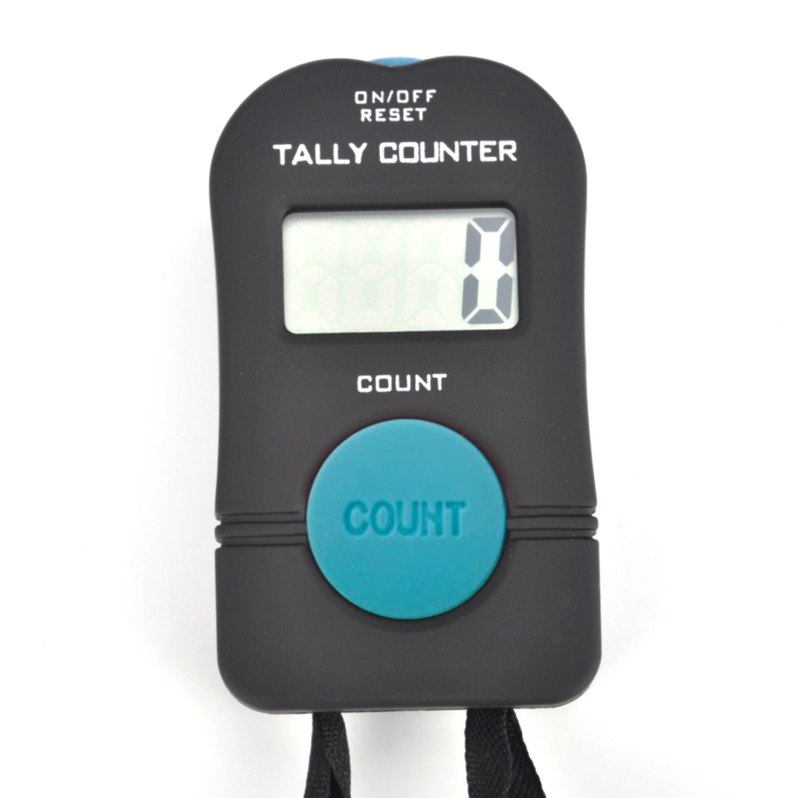

# Модуль collections

> Ссылка на оригинальную статью: [Не изобретать велосипед, или Обзор модуля collections в Python](https://proglib.io/p/ne-izobretat-velosiped-ili-obzor-modulya-collections-v-python-2019-12-15).

В статье мы на примерах разобрали модуль collections, существенно дополняющий функциональность встроенных типов данных Python.

Типы данных Python не ограничиваются стандартными. Модуль [collections](https://docs.python.org/3/library/collections.html) содержит специализированные классы контейнеров, альтернативных традиционным `dict`, `list` и `tuple`.

Это доступный «из коробки» родной модуль Python – те самые батарейки, что идут в комплекте. Уверенное владение инструментарием collections, [itertools](https://docs.python.org/3/library/itertools.html) и других модулей стандартной библиотеки – одна из черт, отличающих продвинутых питонистов от новичков.

Рассмотрим на примерах самые популярные составляющие модуля collections для Python 3 (проверено на 3.6). Для начала импортируйте библиотеку:

```python
import collections
```

## Счётчик (Counter)



Одна из распространённых задач, для которой начинающие питонисты придумывают собственные решения, – подсчёт элементов последовательности: списка, строки символов и т. д.

Если нужно что-то посчитать, определить количество вхождений или наиболее (наименее) часто встречающихся элементов, используйте объекты класса `Counter`. Создаются они с помощью конструктора `collections.Counter()`.

Функция принимает итерируемый аргумент и возвращает словарь, в котором ключами служат индивидуальные элементы, а значениями – количества повторений элемента в переданной последовательности. Посчитаем, сколько раз встречается каждая буква в слове «абракадабра»:

```python
>>> list_of_letters = list('абракадабра')
>>> letter_cnt = collections.Counter(list_of_letters)
>>> letter_cnt
Counter({'а': 5, 'б': 2, 'р': 2, 'к': 1, 'д': 1})
```

Обращение к ключам происходит аналогично обычному словарю:

```python
>>> letter_cnt['а']
5
```

Если элемент отсутствовал в последовательности, при обращении по ключу счётчик не вызовет исключение, а вернет нулевое значение:

```python
>>> letter_cnt['ю']
0
```

Присвоение нуля ключу не удаляет это значение, а создаёт соответствующую пару:

```python
>>> letter_cnt['в'] = 0
>>> letter_cnt
Counter({'а': 5, 'б': 2, 'р': 2, 'к': 1, 'д': 1, 'в': 0})
```

Чтобы удалить пару `key-value`, используем `del`:

```python
>>> del letter_cnt['в']
>>> letter_cnt
Counter({'а': 5, 'б': 2, 'р': 2, 'к': 1, 'д': 1})
```

В качестве аргумента конструктор принимает не только последовательность, но и словарь, содержащий результаты подсчёта:

```python
>>> emotion_cnt = collections.Counter({'like':2, 'dislike':3})
>>> emotion_cnt
Counter({'like': 2, 'dislike': 3})
```

Метод `elements()` преобразует результаты подсчета в итератор:

```python
>>> list(emotion_cnt.elements())
['like', 'like', 'dislike', 'dislike', 'dislike']
```

Метод `most_common(n)` ищет `n` самых повторяющихся элементов. Найдём для примера три наиболее частых символа:

```python
# без передачи аргумента выводятся все элементы
# в порядке от наиболее частых к наиболее редким

>>> letter_cnt.most_common(3)
[('а', 5), ('б', 2), ('р', 2)]
```

Метод возвращает список кортежей вида (ключ, число повторений).

Нередко интерес представляют не самые частотные, а уникальные значения, самые редкие элементы. Их можно найти срезом с шагом `-1`:

```python
>>> letter_cnt.most_common()[:-3:-1]
[('д', 1), ('к', 1)]
```

Счётчики складываются и вычитаются друг из друга:

```python
>>> letter_cnt + emotion_cnt
[('д', 1), ('к', 1)]
>>> emotion_cnt - collections.Counter(like=1, dislike=3)
Counter({'like': 1})
```

Операнд `&` даст минимальные значения для одних и тех же подсчитываемых элементов, операнд `|` – максимальные:

```python
>>> c = collections.Counter(a=4, b=2, c=0, d=-2)
>>> d = collections.Counter(a=1, b=2, c=3, d=4)
>>> c & d
Counter({'b': 2, 'a': 1})
>>> c | d
Counter({'a': 4, 'd': 4, 'c': 3, 'b': 2})
```

Как видно из примера, счётчику можно передавать отрицательные значения. Однако для перечисленных операций хранятся только положительные подсчеты. Нулевые или отрицательные значения обычно приходится хранить при вычитании, что реализовано в методе `subtract()`:

```python
>>> c.subtract(d)
>>> c
Counter({'a': 3, 'b': 0, 'c': -3, 'd': -6})
```

Обратите внимание, что метод `subtract()` обновляет сам счётчик, а не создает новый.

Распространенные шаблоны применения `Counter`:

```python
>>> sum(letter_cnt.values())  # число всех посчитанных элементов
11
>>> list(letter_cnt)  # список уникальных элементов исходной последовательности
['а', 'б', 'р', 'к', 'д']
>>> set(letter_cnt)
{'а', 'б', 'д', 'к', 'р'}
>>> dict(letter_cnt)  # счетчик это подкласс словаря, можно преобразовать в обычный dict
{'а': 5, 'б': 2, 'р': 2, 'к': 1, 'д': 1}
```

Унарные операции оставляют только положительные или отрицательные подcчёты:

```python
>>> +c  # способ вывести положительные подсчеты
Counter({'a': 3})
>>> -c # способ вывести отрицательные подсчеты
Counter({'c': 3, 'd': 6})
>>> c.clear()  # Очищаем счетчик
>>> c
Counter()
```

Счетчик в сочетании с регулярными выражениями используется для частотного анализа текста. Давайте узнаем, какие десять слов чаще прочих встречаются в тексте «Евгения Онегина»:

```python
>>> import re
>>> words = re.findall(r'\w+', open('onegin.txt').read().lower())
>>> collections.Counter(words).most_common(10)
[('и', 1011),
 ('в', 606),
 ('не', 387),
 ('он', 294),
 ('на', 260),
 ('с', 240),
 ('я', 238),
 ('как', 192),
 ('но', 190),
 ('что', 167)]
```

## Словарь со значением по умолчанию (defaultdict)


Что будет, если обратиться к словарю по ключу, которого в нем ещё нет?

Верно, исключение `KeyError`:

```python
>>> d = dict()
>>> d['name'] = 'James' 
>>> d['surname'] = 'Bond'
>>> d['patronymic']
KeyError Traceback (most recent call last) <...>
```

Если нет нужды отлавливать исключение, достаточно использовать альтернативный вариант словаря – `collections.defaultdict`.

Соответствующему конструктору в качестве аргумента передается тип элемента по умолчанию:

```python
>>> d = collections.defaultdict(str)
>>> d['name'] = 'James' 
>>> d['surname'] = 'Bond'
>>> d['patronymic']
''
>>> d
defaultdict(str, {'name': 'James', 'surname': 'Bond', 'patronymic': ''})
```

Таким образом, для ключей, к которым происходит обращение, конструктор поставит в соответствие дефолтный элемент данного типа. В случае `str` – пустая строка, для целых чисел – `0` и т. д.

Обычные словари имеют метод `setdefault()`, который позволяет добиться того же результата, но его использование делает программный код менее наглядным и замедляет исполнение.

Помимо `str` и `int`, `defaultdict` часто используют в связке с пустым списком, чтобы начинать добавление элементов без лишнего кода:

```python
>>> dict_of_lists = collections.defaultdict(list)
>>> for i in range(5):
...     dict_of_lists[i].append(i)
... 
>>> dict_of_lists
defaultdict(<class 'list'>, {0: [0], 1: [1], 2: [2], 3: [3], 4: [4]})
```

Можно видеть, что при таком подходе нет необходимости ни проверять наличие соответствующих ключей, ни создавать предварительно пустые списки.

## Словарь с памятью порядка добавления элементов (OrderedDict)

Ощутимость пользы `OrderedDict` так повлияла на обычный `dict`, что в новых версиях Python различий между ними становится всё меньше. В былые времена `OrderedDict` кардинально отличался от обычного словаря тем, что умел запоминать порядок вставки. Но с версии Python 3.6 на это способен и обычный словарь. Однако некоторые различия между ними все равно остаются:

1. Обычный `dict` был разработан, чтобы быть лучшим в операциях, связанных с [мапированием](https://ru.wikipedia.org/wiki/%D0%9C%D0%B0%D0%BF%D0%B8%D1%80%D0%BE%D0%B2%D0%B0%D0%BD%D0%B8%D0%B5). Отслеживание порядка вставки для него – дело вторичное. И наоборот, `OrderedDict` хорош в операциях переупорядочения, а эффективность, скорость итераций и производительность не главное.
2. Алгоритмически `OrderedDict` может обрабатывать частые операции переупорядочения лучше, чем `dict`.

Так как `OrderedDict` это упорядоченная последовательность, объекты содержат соответствующие методы, реорганизующие структуру:

1. `popitem(last=True)` – удаляет последний элемент если `last=True`, и первый, если `last=False`
2. `move_to_end(key, last=True)` – переносит ключ key в конец, если `last=True`, и в начало, если `last=False`

```python
>>> d = collections.OrderedDict.fromkeys('abcde')
>>> d.move_to_end('b')
>>> ''.join(d.keys())
'acdeb'
>>> d.move_to_end('b', last=False)
>>> ''.join(d.keys())
'bacde'
```

## Контейнер словарей (ChainMap)


После разговора о словарях самое время обсудить класс, умеющий объединять словари в надструктуру – ChainMap. При этом получается не один общий словарь, а их совокупность, в которой каждый словарь остаётся независимой составляющей:

```python
>>> letters = {'a':1, 'b':2}
>>> vowels = {'a':1, 'b':0, 'c':0, 'd': 0, 'e':1}
>>> chain = collections.ChainMap(letters, vowels)
>>> chain
ChainMap({'a': 1, 'b': 2}, {'a': 1, 'b': 0, 'c': 0, 'd': 0, 'e': 1})
```

При обращении к `ChainMap` по ключу одного из словарей, происходит поиск значения среди всех словарей, при этом нет необходимости указывать конкретный словарь:

```python
>>> chain['e']
1
```

При поиске `ChainMap` выводит первое найденное значение (проходя словари по очереди добавления). В том числе если в словарях несколько одинаковых ключей:

```python
>>> chain['b']
2
```

Изменение содержания словаря изменяет и `ChainMap`. Нет необходимости перезаписывать надструктуру:

```python
>>> letters['c'] = 3
>>> chain
ChainMap({'a': 1, 'b': 2, 'c': 3}, {'a': 1, 'b': 0, 'c': 0, 'd': 0, 'e': 1})
```

Так как `ChainMap` это комбинация словарей, логично, что у неё есть методы `keys()` и `values()`:

```python
>>> list(chain.keys())
['c', 'd', 'a', 'e', 'b']
>>> list(chain.values())
[3, 0, 1, 1, 2]
```

Значения `values` соответствуют списку `keys`, как это было описано выше. То есть в случае несколько совпадающих ключей, выводится значение для первого из словарей, где встречается этот ключ.

При необходимости расширить составленный ранее ChainMap можно методом `new_child()`:

```python
>>> consons = {'a':0, 'b':1, 'c':1}
>>> chain.new_child(consons)
ChainMap({'a': 0, 'b': 1, 'c': 1}, {'a': 1, 'b': 2, 'c': 3}, {'a': 1, 'b': 0, 'c': 0, 'd': 0, 'e': 1})
```

Обратите внимание, что метод не обновляет старую структуру, а создаёт новую.

```python

```

```python

```

```python

```

```python

```

```python

```

```python

```

```python

```

```python

```

```python

```

```python

```

```python

```

```python

```

```python

```

```python

```

```python

```
