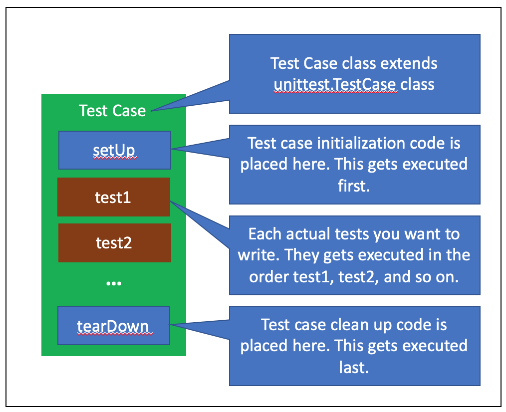

# Юнит-тестирование в Python

**Unit-tests** кода является неотъемлемой частью жизненного цикла разработки программного обеспечения. *Unit-tests* также формируют основу для проведения регрессионного тестирования, то есть они гарантируют, что система будет вести себя согласно сценарию, когда добавятся новые функциональные возможности или изменяются существующие.

В этой статье мы увидим основную идею юнит-тестирования на примере одного Python класса. На практике нам придется писать большое количество тестов, добавлять их в общий тестовый набор и запускать их всех вместе.

Сегодня мы сосредоточимся на тестировании *back-end* кода. К примеру некоторый разработчик реализовал небольшой проект, например, *Calculator.py*, а ваша задача состоит в том, чтобы убедиться, что разработанный проект действительно соответствует заявленным параметрам и ведет себя в различных ситуациях так, как ожидается.

Предположим, что мы написали класс **Calculator** для выполнения основных вычислительных функций: сложения, вычитания, умножения и деления.

*Calculator.py*

```python
#A simple calculator
class Calculator:

    #empty constructor
    def __init__(self):
        pass

    #add method - given two numbers, return the addition
    def add(self, x1, x2):
        return x1 + x2

    #multiply method - given two numbers, return the 
    #multiplication of the two
    def multiply(self, x1, x2):
        return x1 * x2

    #subtract method - given two numbers, return the value
    #of first value minus the second
    def subtract(self, x1, x2):
        return x1 - x2

    #divide method - given two numbers, return the value
    #of first value divided by the second
    def divide(self, x1, x2):
        if x2 != 0:
        return x1/x2
```

Юнит-тесты нужны, чтобы убедиться в том, что методы в приведенном выше классе работают так, как запланировано.

В стандартной библиотеке Python находится пакет **unittest**. Если в вашей библиотеке его нет, используйте модуль *pip* для его установки.

Юнит-тест имеет следующую структуру:



`setUp()` и `tearDown()` – это стандартные методы, которые поставляются с пакетом **unittest** (они определены в классе `unittest.TestCase`). В зависимости от нашего тестового случая мы можем переопределять или использовать два этих метода по умолчанию.

Пришло время посмотреть на код юнит-теста:

*TestCalculator.py*

```python
import unittest

from Calculator import Calculator

#Test cases to test Calulator methods
#You always create  a child class derived from unittest.TestCase
class TestCalculator(unittest.TestCase):

    #setUp method is overridden from the parent class TestCase
    def setUp(self):
        self.calculator = Calculator()

    #Each test method starts with the keyword test_
    def test_add(self):
        self.assertEqual(self.calculator.add(4,7), 11)

    def test_subtract(self):
        self.assertEqual(self.calculator.subtract(10,5), 5)

    def test_multiply(self):
        self.assertEqual(self.calculator.multiply(3,7), 21)

    def test_divide(self):
        self.assertEqual(self.calculator.divide(10,2), 5)

# Executing the tests in the above test case class
if __name__ == "__main__":
    unittest.main()
```

Хотя это и не обязательно, но как правило следует называть тестовый класс с префиксом Test (в нашем случае *TestCalculator*). Ключевым требованием в этом классе является наследование от класса `unittest.TestCase`.

Всякий раз, когда выполняется эти юнит-тесты, сначала выполняется метод `setUp()`. В нашем случае мы просто создаем объект класса `Calculator` и сохраняем его как атрибут класса. В родительском классе есть несколько других методов по умолчанию, которые мы рассмотрим позже.

На данный момент все, что мы будем делать, это писать методы с шаблонными названиями *test_xxx* для тестирования каждого метода в классе *Calculator*. Обратите внимание, что все тестовые методы начинаются с префикса *test_*. Это обозначение того, что это методы тестирования.

В каждом из методов тестирования мы использовали встроенный метод `assertEqual`, чтобы проверить, возвращают ли методы калькулятора ожидаемое значение. Если возвращаемое значение равно ожидаемому значению, то тест проходит успешно, в противном случае он завершается неудачей.

Есть много других встроенных методов типа **assert**.

Последняя строка в приведенном выше коде тестирования запускает тестовый случай *TestCalculator*. Он выполняет каждый тестовый метод, определенный внутри класса, и выдает результат.

Для запуска тестирования необходимо запустить модуль *TestCalculator.py*, можно передать ключ `-v` (verbose) для более полного вывода информации:

```python
python3 TestCalculator.py -v
```

Мы видим результаты работы наших юнит-тестов. Все они завершились успехом, ошибок не возникло:

```bash
test_add (__main__.TestCalculator) ... ok
test_divide (__main__.TestCalculator) ... ok
test_multiply (__main__.TestCalculator) ... ok
test_subtract (__main__.TestCalculator) ... ok

--------------------------------------------------------------------
Ran 4 tests in 0.000s

OK
```

Что делать, если что-то не работает, как ожидалось? Давайте изменим ожидаемое значение *test_divide* с `5` на `6` (5 – было правильным значением), чтобы посмотреть, что случится при сбое. Это не ошибка в исходном коде, а ошибка в тестовом наборе, у нас тоже могут быть ошибки в тестовых наборах, поэтому всегда проверяйте тестовые сценарии на наличие ошибок.

*TestCalculator.py*

```python
import unittest

from Calculator import Calculator

#Test cases to test Calulator methods
#You always create  a child class derived from unittest.TestCase class
class TestCalculator(unittest.TestCase):

    #setUp method overridden from the parent class TestCase
    def setUp(self):
    self.calculator = Calculator()
    
    ...
    
    def test_divide(self):
    self.assertEqual(self.calculator.divide(10,2), 6)

# Executing the tests in the above test case class
if __name__ == "__main__":
    unittest.main()
```

Теперь, при запуске наших тестов мы получим следующий результат:

```bash
test_add (__main__.TestCalculator) ... ok
test_divide (__main__.TestCalculator) ... FAIL
test_multiply (__main__.TestCalculator) ... ok
test_subtract (__main__.TestCalculator) ... ok

====================================================================
FAIL: test_divide (__main__.TestCalculator)
--------------------------------------------------------------------
Traceback (most recent call last):
  File "TestCalculator.py", line 23, in test_divide
    self.assertEqual(self.calculator.divide(10,2), 6)
AssertionError: 5.0 != 6

--------------------------------------------------------------------
Ran 4 tests in 0.001s

FAILED (failures=1)
```

В выводе написано, что 3 из 4 тестов прошли успешно, а один не удался. В реальном сценарии, предполагается, что наш тестовый случай является верным, то есть таким образом он помогает определять неправильно реализованную части (юниты) программы.

> Первод статьи [A Quick Start Guide to Python unittest (Part 1)](https://medium.com/@mashood.snhu/a-quick-start-guide-to-python-unittest-part-1-9653683637ca)